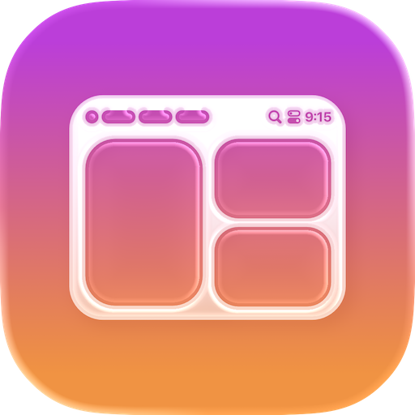

# 🚀 AeroSpaceBar

<!--suppress HtmlDeprecatedAttribute -->
<div align="center">
  <!--suppress CheckImageSize -->

</div>

> **A modern macOS menu bar application for managing AeroSpace window manager spaces and windows with a beautiful SwiftUI interface**

[](https://swift.org)
[](https://www.apple.com/macos/)
[](https://github.com/rdrkr/aerospacebar-app/releases/latest)

<div align="center">
  
</div>

## 📖 Overview

AeroSpaceBar is a sophisticated macOS menu bar application that provides seamless integration with the [AeroSpace window manager](https://github.com/nikitabobko/AeroSpace). Built with modern SwiftUI and following Clean Architecture principles, it offers an intuitive interface for managing your workspace spaces and windows directly from the menu bar.

### ✨ Key Features

- 🎨 **Beautiful UI**: Modern SwiftUI interface with smooth animations and hover effects
- ⚡ **Lightning Fast**: Optimized performance with efficient data refresh and icon caching
- 🔒 **Privacy Focused**: Runs entirely locally, no data sent to external servers
- 🔧 **Spaces & Groups**: Organize and manage workspace windows and menubar groups with custom ranges and settings
- 🎨 **Advanced Theming**: Comprehensive theme system with presets, per-space customization, and visual properties
- 🎛️ **Advanced Settings**: Comprehensive customization including themes, performance, and developer options
- 🌐 **System Integration**: Automatic menu bar visibility matching and wallpaper detection
- 🔄 **Software Updates**: Automatic update checking and installation
- ⚙️ **TOML Configuration**: Native support for AeroSpace TOML configuration file monitoring
- ⌨️ **Keyboard Shortcuts**: Advanced keyboard shortcut support and global key detection
- 🖥️ **Screen Capture Support**: Optional screen sharing permission handling for advanced features

## 🚀 Installation

### Prerequisites

- **macOS 15.0+** (Sequoia or later)
- **[AeroSpace window manager](https://github.com/nikitabobko/AeroSpace)** installed and running

### Option 1: Homebrew (Recommended)

The easiest way to install AeroSpaceBar is through Homebrew:

```bash
# Add the tap
brew tap rdrkr/tap

# Install AeroSpaceBar
brew install --cask aerospacebar
```

Or install in one command:

```bash
brew install --cask rdrkr/tap/aerospacebar
```

### Option 2: Download Release

1. Visit the [Releases page](https://github.com/rdrkr/aerospacebar-app/releases/latest)
2. Download the latest `.zip` file
3. Extract the zip file
4. Drag `AeroSpaceBar.app` to your Applications folder
5. Launch the app

## 🎮 Usage

### Getting Started

1. **Ensure AeroSpace is Running**
   ```bash
   # Check if AeroSpace is running
   ps aux | grep aerospace

   # Start AeroSpace if not running
   aerospace start
   ```

2. **Launch AeroSpaceBar**
   - Open AeroSpaceBar from your Applications folder or Launchpad
   - The app icon will appear in your menu bar

3. **Explore Features**
   - Click the menu bar icon to see all available spaces
   - Click on any space to switch to it
   - Hover over spaces to preview their windows
   - Access Settings via the app menu (`Cmd + ,`)

### Menu Bar Interface

The menu bar displays:

- 🎯 **Current Space**: Shows the currently focused space
- 📊 **Space Count**: Number of total spaces
- ⚡ **Status Indicator**: Shows if AeroSpace is running
- 👥 **Groups Display**: Shows configured space groups (when enabled)
- 🎨 **Dynamic Theming**: Adapts to system wallpaper and menu bar visibility

### App Menu

Access the app menu by clicking the AeroSpaceBar icon:

- ⚙️ **Settings...** (`Cmd + ,`): Open comprehensive settings window
  - **General**: Basic appearance and behavior settings
  - **Groups**: Configure menu bar applications group organization
  - **Spaces**: Configure per-space visual properties
  - **Advanced**: Theme presets, configuration, and software updates
- ℹ️ **About AeroSpaceBar**: Show app information and version
- 🚪 **Quit AeroSpaceBar** (`Cmd + Q`): Exit the application

### Configuration

1. **Basic Settings**
   - Click the menu bar icon → Settings
   - Adjust visual themes, transparency, and appearance
   - Enable/disable empty spaces and window titles
   - Configure performance options

2. **Advanced Customization**
   - Per-space visual customization
   - Custom theme presets
   - TOML configuration file monitoring
   - Performance metrics and logging

### Pro Tip: Enhanced Access with Raycast

For keyboard-driven workflow, we recommend [Raycast](https://www.raycast.com):

1. Install Raycast (free for personal use)
2. Press `Cmd + Space` to open Raycast
3. Type "Search Menu Items"
4. Search for "AeroSpaceBar" to quickly access menu options

## 🔄 Updating

### Via Homebrew

```bash
# Update tap repository
brew update

# Upgrade to the latest version
brew upgrade --cask aerospacebar
```

### Via App

AeroSpaceBar includes automatic update checking:
- Updates are checked automatically (configurable in Advanced Settings)
- You'll be notified when a new version is available
- Click "Install Update" to download and install

### Manual Update

1. Download the latest release from the [Releases page](https://github.com/rdrkr/aerospacebar-app/releases/latest)
2. Replace the existing app in your Applications folder

## 🗑️ Uninstallation

### Via Homebrew

```bash
# Uninstall the app
brew uninstall --cask aerospacebar

# Remove all application data (optional)
brew uninstall --cask --zap aerospacebar
```

### Manual Uninstallation

1. **Delete the app**
   ```bash
   rm -rf /Applications/AeroSpaceBar.app
   ```

2. **Remove application data** (optional)
   ```bash
   rm -rf ~/Library/Application\ Support/com.rdrkr.AeroSpaceBar
   rm -rf ~/Library/Caches/com.rdrkr.AeroSpaceBar
   rm ~/Library/Preferences/com.rdrkr.AeroSpaceBar.plist
   ```

## 💬 Community & Support

### Getting Help

- 📖 **Documentation**: Check this README and [Wiki](https://github.com/rdrkr/aerospacebar-app/wiki)
- 💬 **Discussions**: Ask questions and share ideas in [GitHub Discussions](https://github.com/rdrkr/aerospacebar-app/discussions)
- 🐛 **Bug Reports**: Report issues on [GitHub Issues](https://github.com/rdrkr/aerospacebar-app/issues)
- 💡 **Feature Requests**: Suggest new features in [GitHub Issues](https://github.com/rdrkr/aerospacebar-app/issues/new)

### Contributing

We welcome contributions! Here's how you can help:

- 🐛 **Report Bugs**: Found a bug? [Open an issue](https://github.com/rdrkr/aerospacebar-app/issues/new)
- 💡 **Suggest Features**: Have an idea? [Request a feature](https://github.com/rdrkr/aerospacebar-app/issues/new)
- 📖 **Improve Documentation**: Help us improve docs
- 💬 **Join Discussions**: Share your experience and help others
- ⭐ **Star the Project**: Show your support!

### Community Guidelines

- Be respectful and constructive
- Search existing issues before creating new ones
- Provide detailed information when reporting bugs
- Follow the issue templates when available

## 🙏 Acknowledgments

- **[AeroSpace](https://github.com/nikitabobko/AeroSpace)**: The amazing window manager that makes this possible
- **Community Contributors**: Thank you to everyone who reports issues, suggests features, and helps improve AeroSpaceBar!

## 📊 Project Stats


---

<div align="center">

**Made with ❤️ by [Ronen Druker](https://github.com/rdrkr)**

[⭐ Star this repo](https://github.com/rdrkr/aerospacebar-app/stargazers) | [🐛 Report a bug](https://github.com/rdrkr/aerospacebar-app/issues) | [💡 Request a feature](https://github.com/rdrkr/aerospacebar-app/issues/new) | [💬 Discussions](https://github.com/rdrkr/aerospacebar-app/discussions)

</div>
